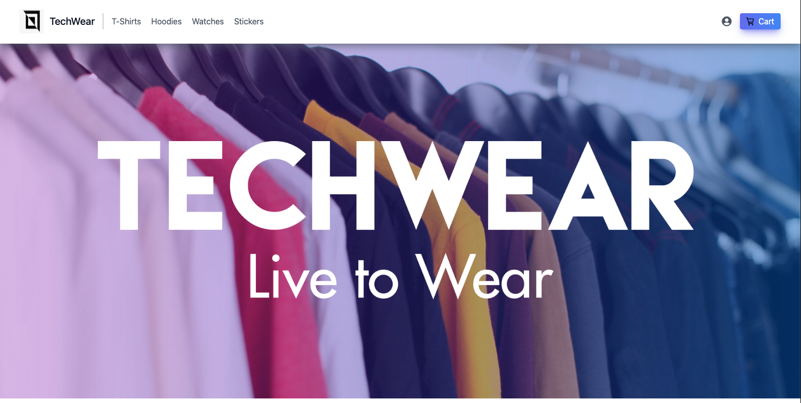
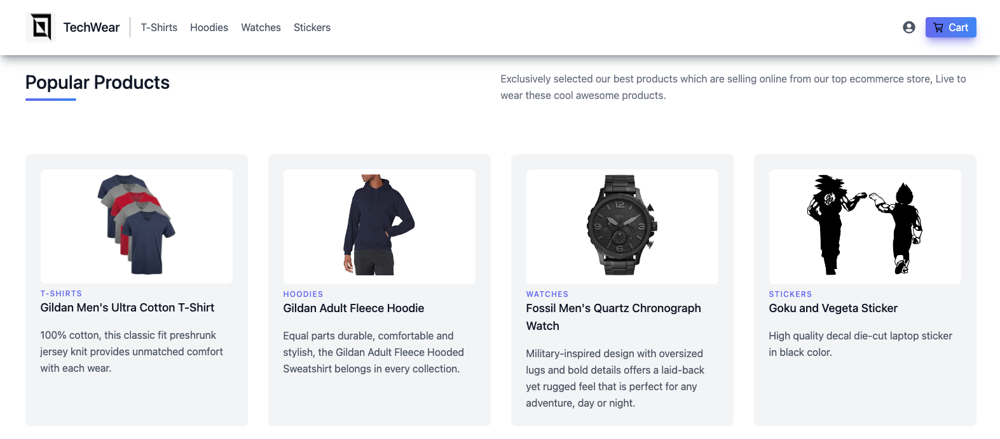
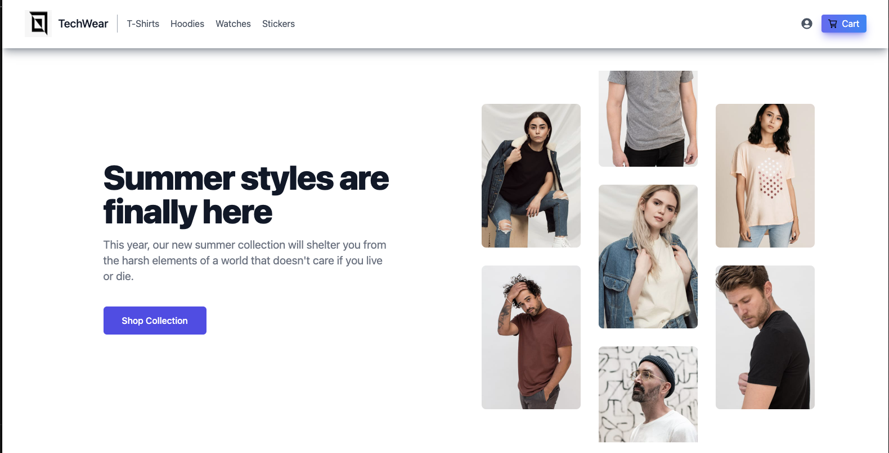
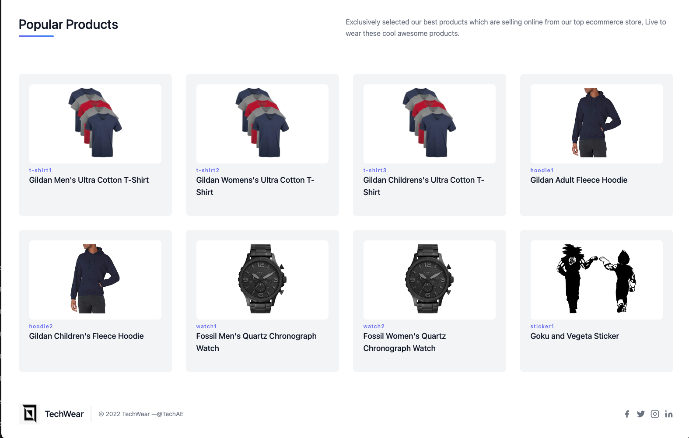

# Ecommerce Platform using NEXTJS and TAILWINDCSS

<br/>
<table align="center">
    <thead align="center">
        <tr border: 1px;>
            <td><b>Project Stats</td>
            <td><b>🌟 Stars</b></td>
            <td><b>🍴 Forks</b></td>
            <td><b>🐛 Issues</b></td>
            <td><b>🔔 Open PRs</b></td>
            <td><b>🔕 Close PRs</b></td>
        </tr>
     </thead>
    <tbody>






To start MongoDB Server:

```bash
# to create and start Mongo container
$ docker-compose up

# to stop mongo docker container
$ docker-compose down

# to seed MongoDb with Fake data
$ yarn seed
# or
$ npm run seed

```

## Tech Stack

**Frontend:** NextJS, TailwindCSS

**Database:** MongoDB - Mongoose

## Contribution

Check out <a href="/CONTRIBUTING.md">Contribution Document</a>

## Our Contributors

<a href="https://github.com/jonathans199/ecommerce-nextjs/graphs/contributors">
</a>

<br>
<div align="center">
Show some ❤️ by starring this awesome repository!
</div>
